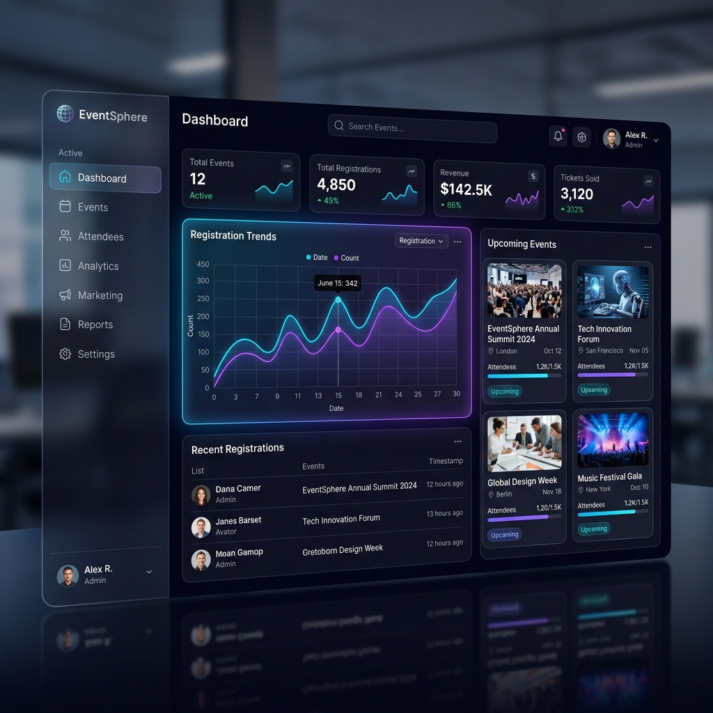

# 🌌 EventSphere: The Future of Event Management

[]()
[](https://flask.palletsprojects.com/)
[](https://tailwindcss.com/)
[](https://opensource.org/licenses/MIT)

**EventSphere** is a premium, high-performance event discovery and management ecosystem. Designed for the modern era, it combines a stunning glassmorphic UI with robust backend architecture to deliver a seamless experience for organizers and attendees alike.



---

## ✨ Key Features

### 🎨 Visual Excellence
- **District-Style UI**: A bespoke dark-mode experience built with Tailwind CSS, featuring smooth micro-animations and glassmorphism.
- **Responsive Design**: Fully optimized for Desktop, Tablet, and Mobile devices.
- **Dynamic Interactivity**: Hover effects and transitions that make the platform feel alive.

### 🛠️ Organizer Power-Tools
- **Real-Time Analytics**: Visualise registration trends, revenue, and attendance with interactive **Chart.js** dashboards.
- **Attendee Management**: Full CRUD operations for events, attendee lists, and data export (CSV/Excel).
- **Broadcast System**: Instantly communicate with all attendees via a built-in email broadcasting module.
- **Smart Check-in**: Integrated mobile-friendly QR code scanner for rapid on-site entry management.

### 🎟️ Attendee Experience
- **Seamless Discovery**: Categorized event browsing with high-quality visual cards.
- **Instant Ticketing**: Beautifully designed PDF/Image tickets with unique QR codes generated instantly upon registration.
- **Secure Payments**: Integrated **Razorpay** checkout for a frictionless ticket purchasing flow.
- **Feedback Loop**: Post-event feedback collection with an elegant star-rating system.

---

## 🚀 Technical Stack

| Category | Technology |
| :--- | :--- |
| **Backend** | Python, Flask (Factory Pattern & Blueprints) |
| **Frontend** | HTML5, Tailwind CSS, JavaScript (Vanilla/ES6) |
| **Database** | SQLite (Dev) / PostgreSQL (Prod) via SQLAlchemy |
| **Visualization** | Chart.js |
| **Payments** | Razorpay SDK |
| **Communication** | Flask-Mail (SendGrid/SMTP) |
| **Scanner** | HTML5-QRCode |

---

## ⚙️ Quick Start

### 1. Clone & Install
```bash
git clone https://github.com/your-repo/EventSphere.git
cd EventSphere
pip install -r requirements.txt
```

### 2. Configure Environment
Create a `.env` file or set the following variables:
```bash
SECRET_KEY=your-secure-key
MAIL_USERNAME=your-email@example.com
MAIL_PASSWORD=your-app-password
RAZORPAY_KEY_ID=rzp_test_xxxx
RAZORPAY_KEY_SECRET=xxxx
```

### 3. Initialize & Launch
```bash
python run.py
```
The database will be automatically initialized and seeded. Visit `http://localhost:5000` to explore.

---

## 📂 Architecture

```bash
├── app/
│   ├── auth/           # Secure Session & User Management
│   ├── events/         # Core Event Engine (Listings, Search)
│   ├── registrations/  # Ticketing & QR Infrastructure
│   ├── payments/       # Financial Transaction Logic
│   ├── analytics/      # Data Visualisation & Admin Tools
│   ├── models.py       # SQLAlchemy Schema definitions
│   └── templates/      # Refined Tailwind HTML Components
├── config.py           # Multi-environment Configuration
└── run.py              # Application Entry Point
```

---

## 🔐 Sample Access

| Role | Username | Password |
| :--- | :--- | :--- |
| **Admin** | `admin@eventspheres.com` | `password123` |
| **Organizer** | `organizer@eventspheres.com` | `password123` |
| **Student** | `alex@eventspheres.com` | `password123` |

---

## 🗺️ Roadmap
- [ ] **AI-Driven Recommendations**: Suggest events based on user interests.
- [ ] **Multi-Currency Support**: For global event expansion.
- [ ] **Mobile App**: Native iOS/Android apps using React Native.
- [ ] **Advanced Seating Maps**: Interactive seat selection for venues.

---

<div align="center">
  <p>Built with ❤️ for the next generation of event organizers.</p>
  <p><b>EventSphere © 2026</b></p>
</div>
